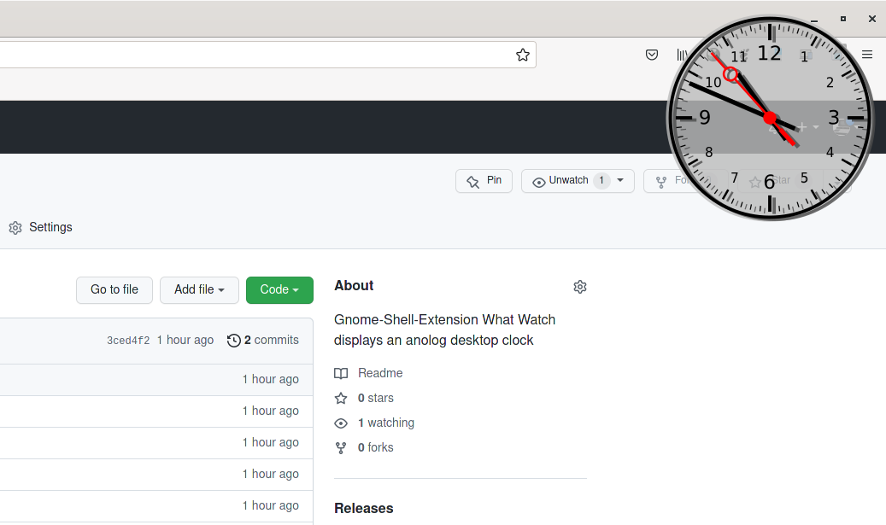
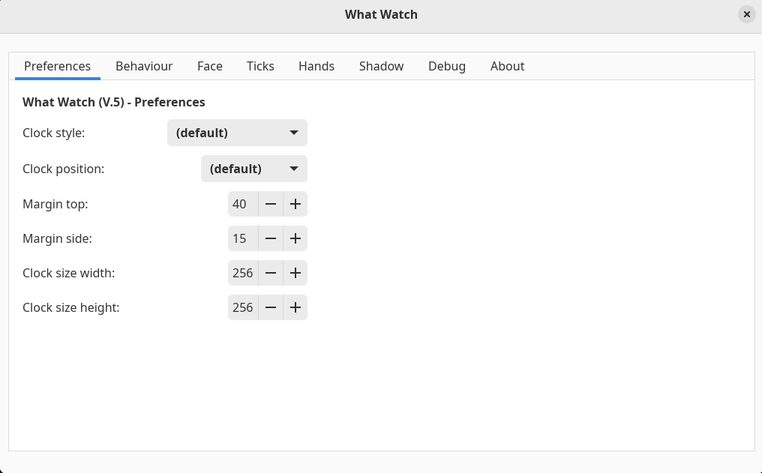

# WhatWatch



## About

This is a gnome-shell-extension that supports the following Gnome-Shell Versions:

* 3.38 - Tested with live Ubuntu 21.04
* 40 - Tested with live Ubuntu 21.10
* 41 - Tested with Manjaro - Gnome
* 42 - Tested with Manjaro - Gnome

It displays an analog clock on the desktop and exposes a great variety of customisation options.



## Install

Visit [ego](https://extensions.gnome.org/extension/4806/what-watch/) to install the latest reviewed release.

## Install any branch / tag / from this Repo

Default branch is `main`.

### First Install

Clone this repo to any local folder...

```
cd ~/myLocalFolder/
git clone git@github.com:Zappo-II/WhatWatch.git
```

###  Update

Later on update the repo with...

```
cd ~/myLocalFolder/WhatWatch
git fetch
git pull
```

Or create a new clone...

### Install plugin

Install the plugin to gnome-shell by executing 

```
cd ~/myLocalFolder/WhatWatch
./install.local.sh
```

This will install to `~/.local/share/gnome-shell/extensions/`

You must restart (X11: `Alt-F2` --> `r`) or logout/relogin (Wayland) to activate the (updated) extension.

Your mileage may vary.

## Documentation

Please take a look at the documentation found in the `.../doc` folder of this repository.

* [WhatWatch-Doc.md](doc/WhatWatch-Doc.md)

## Troubleshooting

* check your system's log `journalctl -f` for any `GJS` / `gnome-shell` messages...
* activate Debug Logging via plugin's preferences page...
* Again, your mileage may vary.

## Issues / Requests

Please report any issues or requests at [github](https://github.com/Zappo-II/WhatWatch/issues)...
