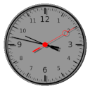

# WhatWatch Documentation

## About

This is a gnome-shell-extension. It displays an analog clock on the desktop and exposes a great variety of customisation options.

## General Usage

The clock is non interactive. If you set it up to be non opaque you'll be able to see any controls hidden behind it. The clock acts as if it was not there in case you click on something behind it.

## Configuration

Use the extensions app of gnome-shell to activate / deactivate the extension or to launch it's settings dialog.

The settings dialog will expose quite a bunch of parameters and attributes of the clock to be configured.

The settings are dived into different tabs for different parts of the clock:

* `Preferences` - General settings affecting the clock as a whole.
* `Face` - Settings that style the clock's face appearance.
* `Ticks` - Settings that style the clock's interval markers.
* `Hands` - Settings that style the clock's hands.
* `Shadow` - Settings that style the shadow behaviour of the clock's elements.

Followed by an `About` tab with some general information on the extension.

### `Preferences`

* __Debug Logging__ - Enable / disable excessive logging to the system's log.
* __Clock Style__ - Select a specific style flavour (currently one of):
    * __OldSchool__ (also __default__) - The base style, clean and classic, I like it...
    * __OldSchool Arabian__ - ...add Arabian numbers.
    * __OldSchool Roman__ - ...add Roman numbers.
    * __Deutsche Bahn__ - ...like seen everywhere in germany's public transportation.
    * __Radar__ - The death star is in firing range...
* __Clock Position__ - Select the general orientation on screen (0,0)...
* __Clock Size Width__ - Width of the clock
    * Width/Height should be the same but you might want to adjust to match your screen's aspect ratio...
    * You MUST DeActivate and ReActivate the extension for this to take effect...
* __Clock Size Height__ - Height of the clock
    * Width/Height should be the same but you might want to adjust to match your screen's aspect ratio...
    * You MUST DeActivate and ReActivate the extension for this to take effect...
* __Track Fullscreen__ - when on the clock will hide behind fullscreen windows (like fullscreen video etc.), otherwise it will even sit on top of those.
    * You MUST DeActivate and ReActivate the extension for this to take effect...
* __Margin Top__ - Pixel Margin from top of screen (will not allways be used depending on _clock position_)
* __Margin Side__ - Pixel Margin from the relevant side of screen (will not allways be used depending on _clock position_)

### `Face`

...sordid details following...

### `Ticks`

...sordid details following...

### `Hands`

...sordid details following...

### `Shadow`

...sordid details following...
